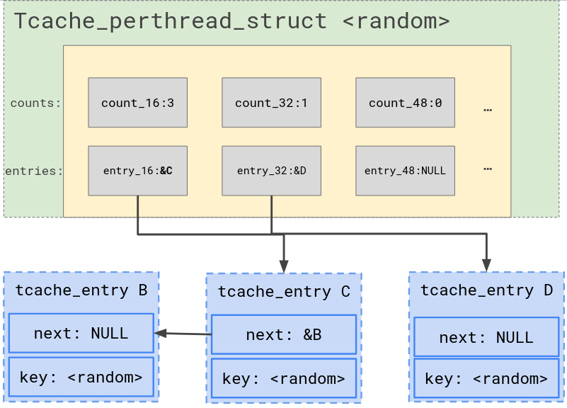
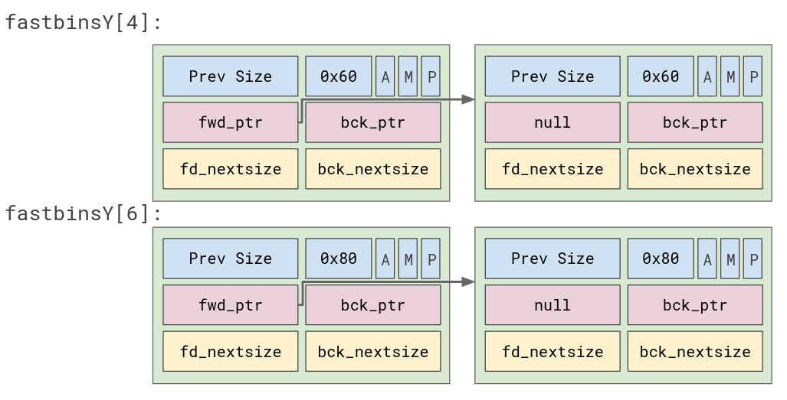
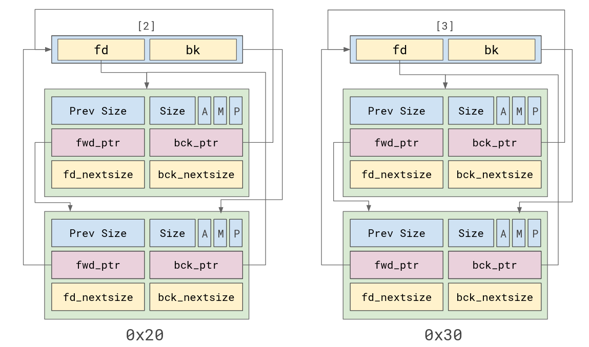
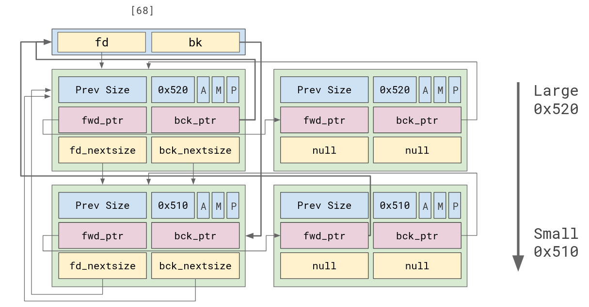
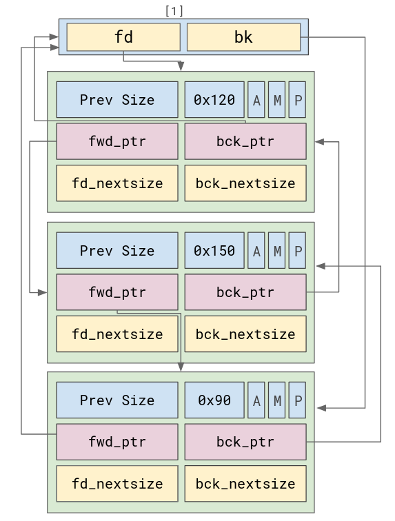

# Glibc heap exploits

This repository contains my master thesis. This includes an updated overview of `ptmalloc2` with a lot of refenerces to the `malloc.c` (glibc 2.41).
!This is only for educational purposes!

# CVE

To better understand how heap exploits can have impact in real life, I decided to study [CVE-202306246](https://nvd.nist.gov/vuln/detail/CVE-2023-6246).
This CVE primarily involves a heap overflow vulnerability, where heap grooming (done with a fuzzer) is used to achieve local privilege escalation (LPE).

# Heap 
This is intended to be used as a cheat sheet. For more information, please refer to the PDF.

## Bins
The `helpers` directory contains simple programs that help you analyze heap bins. To check the state of the heap, set a breakpoint on `puts`.

### Tcache

### Fastbin

### Small bin

### Large bin

### Unsorted bin

## Heap Internals

This diagrams shows the internals of the heap. You can hover over the nodes to see more information. Clicking on a node will take you to the corresponding section of the source code responsible for that action.
### Malloc
[Click here to view malloc SVG](https://github.com/Stefan2320/Master-Thesis/tree/main/images/svg/malloc.svg)
### Free
[Click here to view free SVG](https://github.com/Stefan2320/Master-Thesis/tree/main/images/svg/free.svg)
### Binmap
[Click here to view binmap SVG](https://github.com/Stefan2320/Master-Thesis/tree/main/images/svg/binmap.svg)
